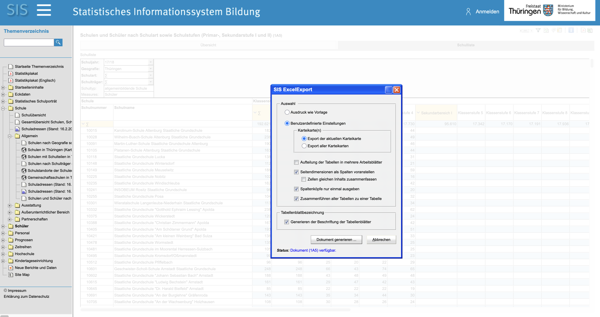

```{r, include = FALSE}
knitr::opts_chunk$set(
  collapse = TRUE,
  comment = "#>"
)
```

# Setup
```{r setup}
library(bekiths)
library(readxl)
library(dplyr)
library(tibble)
library(stringr)
library(ggplot2)
library(tidyr)
```

# Download Rohdaten 
+ Browse [https://www.schulstatistik-thueringen.de](https://www.schulstatistik-thueringen.de)
+ Rubrik: "Schulen und Schüler nach Schulart sowie Schulstufen (Primar-, Sekundarstufe I und II) (1A5)"
+ download Daten
```{r schulportal-screenshot, echo=FALSE, out.width="100%", fig.align="center"}

```

# Spezifiere Spaltennamen und -positionen
```{r j1, echo=TRUE}
# Pfad zu xlsx Rodaten von https://www.schulstatistik-thueringen.de
path <- system.file("extdata", "schulstatistik-thueringen.de", package = "bekiths")

# Position Spalten in xlsx
cols <- c(
  Schuljahr        = 1,
  Schulnummer      = 7,
  Schulname        = 8,
  N_Schule =  9,
  N_Primarbereich = 10,
  N_K01 = 11,
  N_K02 = 12,
  N_K03 = 13,
  N_K04 = 14, 
  N_Sekundarbereich_1 = 15,
  N_K05 = 16,
  N_K06 = 17,
  N_K07 = 18,
  N_K08 = 19,
  N_K09 = 20,
  N_K10 = 21,
  N_Sekundarbereich_2 = 22,
  N_K11 = 23,
  N_K12 = 24,
  N_K13 = 25,
  N_Einfuehrungsphase = 26,
  N_Q01 = 27,
  N_Q02 = 28,
  N_Geistige_Entwicklung = 29
)
```
# Parse Stichtags-Datum und Download-Datum

```{r j2, echo=TRUE}


# Extract Stichtags-Datum und Download-Datum
meta_specs <- list(
  Stichtag = list(                   
    col = 1,
    pattern = "Stichtag:\\s*([^,]+)",
    group=1
  ),
  erstellt_am = list(                     
    col = 1,
    pattern = "erstellt am\\s*([^/]+) ",
    group=1
  )
)
```

# Importiere *.xlsx
```{r import, echo=TRUE}
# Lese alle xlsx Dateien ein und erstelle data frame
df <- read_schools(
  path = path, 
  skip=10,
  cols = cols,
  meta_specs = meta_specs)

str(df)
```


# Spaltentypisierung

```{r type, echo=TRUE}
df_tidy <- df|>
  mutate(
    across(starts_with("N_"), ~ as.integer(.x)), 
    Stichtag = as.POSIXct(
      Stichtag,
      format = "%d.%m.%Y",
      tz = "Europe/Berlin"),
    erstellt_am = as.POSIXct(
      erstellt_am,
      format = "%d.%m.%Y %H:%M",
      tz = "Europe/Berlin"))
```
# Check: Plausibilität Primarschule
```{r check, echo=TRUE}
# gibt es Primarschulen, ohne irgendeine Nennung einer Klassenstufenzahl < 5
df_tidy |>
  filter(!is.na(N_Primarbereich)) |>
  filter(is.na(N_K01) & is.na(N_K02) & is.na(N_K03) & is.na(N_K04)) |>
  select(Schuljahr, Schulnummer, Schulname, N_K01, N_K02, N_K03, N_K04) |>
  print(n = Inf)

# gibt es Schulen mit Zahlen im Primarbereich aber keine expliziten Zahlen für dritte Klassen
df_tidy |>
  filter(!is.na(N_Primarbereich)) |>
  filter(is.na(N_K03)) |>
  select(Schuljahr, Schulnummer, Schulname, N_K01, N_K02, N_K03, N_K04) |>
  print(n = Inf) 


```


# Long format (Klassenstufen)

```{r long, echo=TRUE}
df_long <- df_tidy %>%
  pivot_longer(
    cols = starts_with("N_K"),
    names_to  = "Klassenstufe",
    values_to = "N_Klassenstufe",
    values_drop_na = TRUE
  ) %>%
  mutate(
    Klassenstufe = str_remove(Klassenstufe, "^N_K"),
    Klassenstufe = as.integer(Klassenstufe)
  )

str(df_long)


```

# Zeitliche Entwicklung der Klassenstufenzahlen
```{r sum, echo=TRUE}
# bekannte Drittklässlerangaben
# Hinweis: es gibt auch (schulabhängig) klassenstufenübergreifende Drittklässler,
# die hier nicht mit erfasst sind

df_sum <- df_long |>
  filter(!is.na(N_Klassenstufe)) |> 
  group_by(Schuljahr, Stichtag, Klassenstufe) |>
  summarize(N = sum(N_Klassenstufe, na.rm = TRUE), .groups = "drop")

df_sum |> pivot_wider(names_from = Klassenstufe, values_from = N) |>
  knitr::kable(format = "html")
```

# Abbildung zur zeitlichen Entwicklung der Anzahl Drittklässler
```{r plot, echo=TRUE,fig.width=10, fig.height=6,out.width="100%"}
p <- df_sum |>
  filter(Klassenstufe == 3) |> 
  ggplot(aes(x = Schuljahr, y = N)) +
  geom_col(just = 0) + 
  geom_point(size = 1) + 
  geom_label(aes(label = N), vjust = -0.2) + 
  scale_x_discrete(
    sec.axis = dup_axis(                       # secondary axis on top
      breaks = df_sum$Schuljahr,
      labels = df_sum$Stichtag,
      name   = "Stichtag Schuljahresstatistik"
    )
  ) + 
  theme(
    axis.title.x.top  = element_blank(),       # optional: hide top title
    axis.text.x.top   = element_text(margin = margin(b = 5)),
    axis.text.x.bottom = element_text(margin = margin(t = 5))
  ) + 
  theme_classic() +
  labs(x = "Schuljahr",
       y = "Anzahl",
       title = "Anzahl amtilich bekannter Drittklässler in Thüringen", 
       caption = paste0("Daten-Quelle: schulstatistik-thueringen.de, abgerufen am: ",
                        unique(df_tidy$erstellt_am)))

p
```


